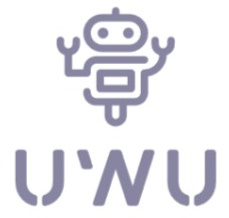

# UwU-Bot Präsentation

## **Android App**

---

## Joysticks

- zwei Joysticks zum steuern der Räder
  - jeweils für linkes und rechtes Rad
- selbst implementiert, von "View" Klasse abgeleitet
- können hoch und runter bewegt werden
- Werte von -100 bis 100 Prozent
  - werden auf nächste Fünf gerundet

## Senden der Daten

- Bluetooth Classic 4.0
- Daten zur Übertragung:
  - Position der Joysticks in Prozent
  - Gesichts ID
- Einweg-Kommunikation

### Android-Bluetooth-Serial Bibliothek

- einfach mit Gerät verbinden
  - verfügbare Geräte auflisten
  - per Name oder MAC Adresse mit Gerät verbinden
- einfach Daten senden und empfangen
- Feedback bei erfolgreicher Verbindung, Daten senden und empfangen

## **Datenübertragung und Verarbeitung**

---

## Empfang der Daten

- ESP32 empfängt Daten mit BluetoothSerial Bibliothek
- ließt immer einzelnen String ein
- String muss weiter verarbeitet werden

## Verarbeitung der Daten

- String besteht aus Befehl und Wert
- Befehl und Wert werden voneinander getrennt
- Befehl (char) gibt an welche Funktion ausgeführt werden soll
- Wert (int) gibt den Wert für diese Funktion an
  - muss gegebenenfalls umgerechnet werden

## Befehle

- L/R - setzt Geschwindigkeit vom linken/rechten Rad
  - Wert von Prozent zu Schritte pro Sekunde umrechnen
  - max. Geschwindigkeit ist im Code festgelegt
  - Ergebnis wird an `setSpeed()` Funktion weitergegeben
- F - ändert am Display angezeigtes Gesicht
  - Wert wird an `drawFace()` Funktion weitergegeben

## **Fahrwerk**

---

## Motoren

- zwei Schrittmotoren
- präzise & schnell
- leistungsstark
- Räder direkt an Achse befestigt
- Ansteuerung mit Treiber

## Schrittmotor-Treiber

- erleichtert Ansteuerung der Motoren
- nur 2 Pins pro Motor am ESP32
- Unterstützt Microstepping
  - erlaubt kleinere Schritte
  - weniger Vibrationen
  - verringertes Dreh- und Haltemoment

## Ansteuerung der Motoren

- AccelStepper Bibliothek
  - Funktionen zur einfachen Ansteuerung von Schrittmotoren und Treibern
- `setSpeed()` Funktion setzt Drehgeschwindigkeit des Motors
- `runSpeed()` so oft wie möglich aufrufen um Treibern Step-Pulse zu senden

### Multitasking

- ESP32 hat zwei Kerne
- können parallel zwei Aufgaben ausführen
- Kern 0 - ruft durchgehend `runSpeed()` auf
- Kern 1 - Bluetooth-Kommunikation, Datenverarbeitung, setzen der Drehgeschwindigkeit  
  und Ansteuerung des Displays

## Räder

- zwei Hinterräder
- 3D modelliert und gedruckt
- aus PLA Kunststoff
- Profil zur besseren Haftung
- vorne zwei omnidirektionale Möbelrollen

## Lenkung

- zwei fixe Räder, können nicht lenken
- Panzersteuerung
- Räder können sich unabhängig voneinander drehen
- ein Rad schneller als das andere - lenken
- entgegengesetzte Richtung - an der Stelle drehen

> Manuel Greiler
